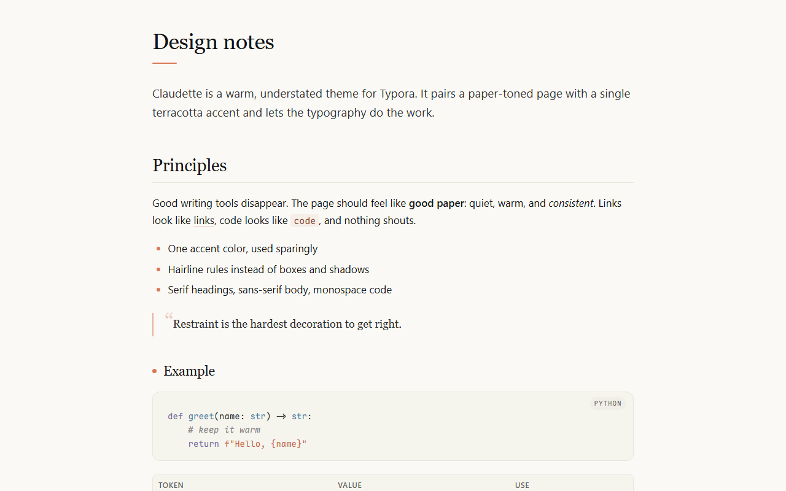

# Claudette

A warm, understated light theme for [Typora](https://typora.io).

Paper-toned background, a single terracotta accent, serif headings, sans-serif body text and hairline rules. Restraint over ornament.



## Features

- **Warm paper palette** — `#faf9f5` page, `#f5f4ed` / `#f0eee6` surfaces, near-black `#141413` text, and one terracotta accent `#d97757` used sparingly (links on hover, list markers, small rules).
- **Editorial typography** — serif headings at weight 400 with tight line-height; the first paragraph after an H1 is styled as a lead paragraph; H6 becomes a small uppercase label.
- **Quiet code blocks** — soft `#f5f4ed` surface, hairline border, `.75rem` radius, language pill in the corner, low-saturation syntax colors drawn from the same palette.
- **Hairline tables** — horizontal rules only, uppercase column headers, subtle row hover.
- **Whole-app styling** — sidebar, file tree, outline, quick-open, search panel, context menus, dialogs, buttons, source mode and scrollbars all follow the same palette and radii.
- **Print-ready** — decorations and hover states are stripped when exporting to PDF.

## Installation

1. Download `claudette.css` (or the whole repository as a ZIP).
2. In Typora open **Preferences → Appearance → Open Theme Folder**.
3. Copy `claudette.css` into that folder.
4. Restart Typora and pick **Claudette** from the **Themes** menu.

## Fonts

Claudette does not bundle any fonts. It prefers the following if installed and falls back to system fonts otherwise:

| Role | Preferred | Fallbacks |
|---|---|---|
| Headings | [Source Serif 4](https://fonts.google.com/specimen/Source+Serif+4) | Charter, Georgia, Noto Serif SC |
| Body | [Inter](https://rsms.me/inter/) | Source Sans 3, Segoe UI, PingFang SC, Microsoft YaHei |
| Code | [JetBrains Mono](https://www.jetbrains.com/lp/mono/) | Maple Mono, Cascadia Code, Consolas |

To change them, edit the three `--font-*` variables at the top of `:root` in `claudette.css`.

## Customization

All colors live in `:root` as CSS variables. The most useful ones:

```css
:root {
    --accent: #d97757;             /* terracotta accent */
    --accent-interactive: #c96442; /* hover / active accent */
    --bg-primary: #faf9f5;         /* page */
    --bg-secondary: #f5f4ed;       /* code blocks, sidebar */
    --fg-primary: #141413;         /* body text */
}
```

The optional decorations (H1 rule, H3 dot, blockquote mark, asterisk on `<hr>`, table hover, …) are grouped at the end of the file under the `点缀` / decorations comment. Delete any block you do not want.

## License

MIT
